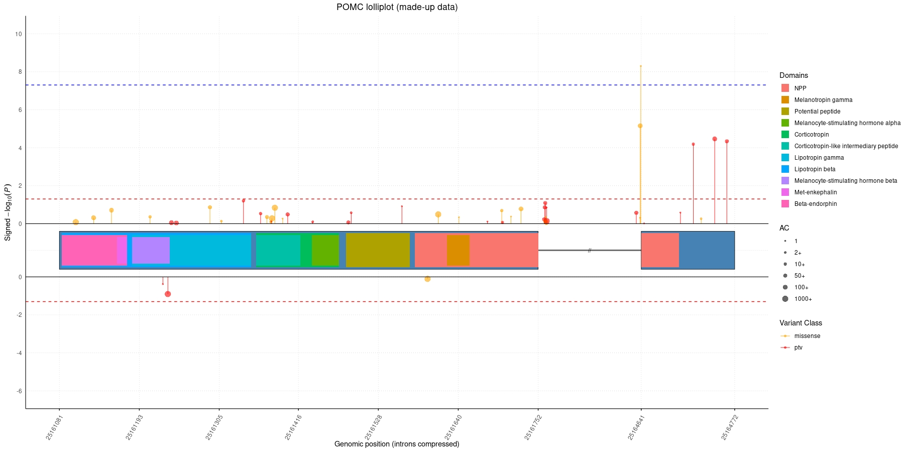

# handyGPlots

An R package for visualising genetic association results overlaid on gene structure. Functions for fetching gene and protein information from Ensembl and UniProt, and plotting lolliplots of variant or domain-level association results.

## Installation
```r
devtools::install_github("JackMurzy/handyGPlots")
```

## Functions

### Data fetching
- `ensembl_gene_lookup()` — fetch gene structure, exon coordinates and canonical transcript info from Ensembl. Accepts gene symbol, ENSG, or ENST.
- `uniprot_lookup()` — two-way resolver between gene symbols and UniProt accessions.
- `get_protein_features()` — fetch annotated protein features (domains, peptides, PTMs etc.) from UniProt, with optional mapping to GRCh38 genomic coordinates.
- `map_protein_feature()` — map amino acid positions to genomic coordinates via Ensembl.

### Plotting
- `create_geneplot()` — plot variant (SNP) or domain-level association results as a lolliplot overlaid on the canonical transcript structure of a gene, with optional intron compression and protein domain annotations.

## Example Plots


## Quick Start
```r
library(handyGPlots)

# Basic gene structure
create_geneplot("POMC")

# With SNP association results
set.seed(42)
pomc_snps <- data.table::data.table(
  SYMBOL = "POMC",
  POS    = c(sample(25161081:25162000, 40), sample(25164500:25164772, 10)),
  BETA   = rnorm(50, mean = 0.5, sd = 0.3),
  P_BOLT_LMM_INF = c(runif(45, 0.01, 1), runif(4, 1e-6, 1e-4), 5e-9),
  AC     = sample(c(1, 5, 20, 100, 500, 2000), 50, replace = TRUE)
)
create_geneplot("POMC", markers = pomc_snps, value_col = "P_BOLT_LMM_INF")

# Colour by variant class
pomc_snps[,class:=sample(c("ptv","missense"),50,replace=T)]
pomc_snps[, `:=`(
  colour    = data.table::fifelse(class == "ptv", "red", "orange"),
  colour_key = class
)]
create_geneplot("POMC", markers = pomc_snps, value_col = "P_BOLT_LMM_INF",
                colour_title = "Class")

# Overlay protein domains from UniProt
pomc_domains <- get_protein_features("POMC", type_limit = "Peptide", map_to_genomic = TRUE)[,.(domain=description,start=genomic_start,end=genomic_end)][!is.na(start)]
create_geneplot("POMC", markers = pomc_snps, value_col = "P_BOLT_LMM_INF",
                domains = pomc_domains)
```

## Dependencies

- `data.table`
- `ggplot2`
- `httr`
- `jsonlite`
- `scales`

## Notes

- All genomic coordinates are GRCh38
- Gene structure is based on the Ensembl canonical transcript
- Protein features are sourced from UniProt reviewed (Swiss-Prot) entries where available